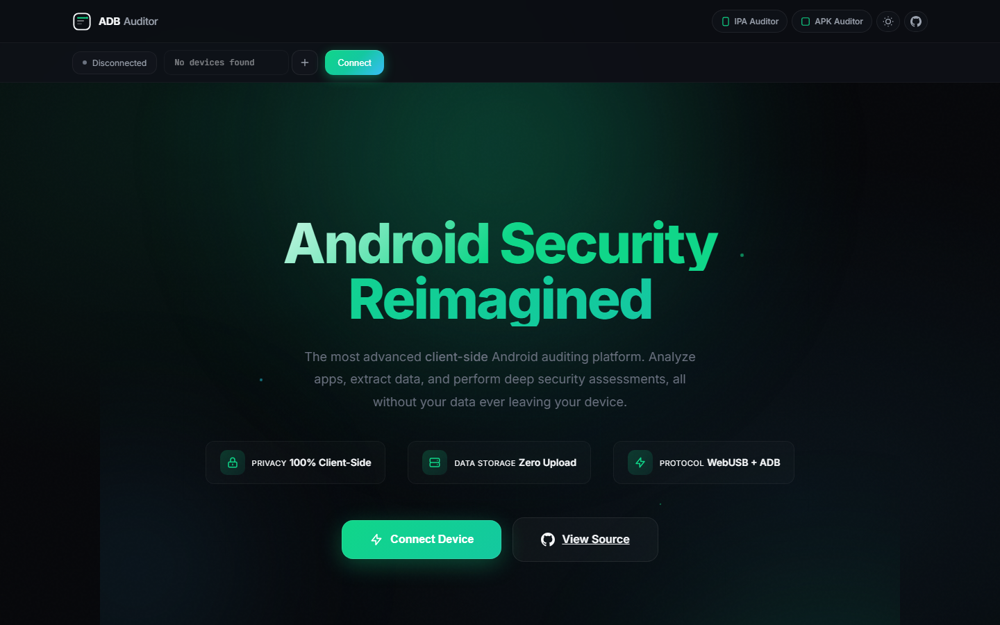

# ADB Auditor

[](LICENSE)
[](../../releases)
[](https://developer.mozilla.org/en-US/docs/Web/JavaScript)
[]()

Plug in an Android phone. The browser opens the USB interface, runs the ADB handshake, signs the auth challenge with a stored RSA key, and from there you can list apps, browse files (root toggle included), open a shell, capture screenshots, and run a MASTG-aligned security scan. Nothing leaves the tab.

Try it: [adbauditor.com](https://adbauditor.com)



## What it actually does

It speaks the real ADB protocol over WebUSB. No host adb-server, no `chrome://` extension, no native bridge.

- **WebUSB transport** claims the device's ADB interface (class `0xFF`, subclass `0x42`, protocol `0x01`) and reads bulk packets directly.
- **CNXN / AUTH handshake** parses the device challenge token and signs it with a 2048-bit RSA key. Raw PKCS#1 v1.5 signing is done in JS (WebCrypto hashes the data first, which ADB does not want), via a BigInt `modPow` over the parsed PKCS#8 private key.
- **Key persistence**: keys are stored in IndexedDB scoped to the origin. After the first authorize, future reconnects are silent, exactly like terminal `adb`.
- **ADB sockets**: full `OPEN` / `OKAY` / `WRTE` / `CLSE` framing for shell, sync (pull / push), and screencap.
- **Security scans** are real ADB commands against `dumpsys`, `pm`, `logcat`, `getprop`, `run-as`, optional `su`. Each finding records the literal evidence string and per-instance matches where applicable.

## Architecture

```
js/
  adb-core.js          ADB protocol: USB transport, CNXN+AUTH, sockets, sync, RSA key store
  app.js               UI coordinator, tabs, rendering, drag and drop, theme cycle
  security-auditor.js  MASTG-aligned tests, returns findings with instances
  pdf.js               PDF audit report (cover, per-test sections, every instance)
src/
  styles.css           Theme (dark + light), layout, components
lib/
  jspdf.umd.min.js     jsPDF 4.2.1
img/
  logo.svg
docs/
  API.md
  SECURITY.md
```

No bundler. No npm install. Open `index.html` in Chrome and it runs.

## Tabs

The dock on the left has six sections:

- **Overview** - Android version, SDK level, user-app count, storage usage, full device properties
- **Applications** - installed package list with friendly names, search, system-apps toggle, pull-APK button, drag-and-drop APK installer
- **Files** - device file browser. Breadcrumb path with click-jump, root toggle, upload, hex viewer for binaries
- **Screenshot** - one click `screencap` capture, preview, download as PNG
- **Shell** - persistent `shell:` socket with command history (Arrow Up / Down)
- **Security** - MASTG-aligned audit with per-test cards and per-finding instance lists

## Security checks

Each test in the auditor returns `{ id, category, title, status, severity, findings[] }`. Findings carry the actual evidence and (where it makes sense) an `instances[]` array of matched lines or components.

| Area | Test | What it actually runs |
|---|---|---|
| Storage | `MASTG-TEST-0001` Local Storage | `run-as <pkg> ls -la shared_prefs/ databases/ files/` plus an `ls /sdcard/Android/data/<pkg>` probe. Each prefs file, sqlite db, or external-storage hit becomes a separate finding. |
| Storage | `MASTG-TEST-0002` Backup | Parses the `flags=[…]` block from `dumpsys package <pkg>`. Reports failure only when the literal `ALLOW_BACKUP` token is present. |
| Storage | `MASTG-TEST-0003` Logcat | `pidof <pkg>` then `logcat -d --pid=<pid>`, scanned for password / token / api_key / bearer / email / credit_card / secret patterns. Matched log lines are attached as instances. |
| Storage | `MASTG-TEST-0004` Clipboard | `service call clipboard` (best-effort, often requires root). |
| Platform | `MASTG-TEST-0020` Exported Components | Walks the Activity / Service / Receiver / Provider resolver tables in `dumpsys package`. Component names listed per finding. |
| Platform | `MASTG-TEST-0034` Deep Links | Parses `intent-filter` data attributes from `dumpsys package`. |
| Platform | WebView config | `pm dump <pkg>` and DEX-strings probe for `setJavaScriptEnabled`, file access, `addJavascriptInterface`, mixed content. |
| Resilience | Root Detection | Looks for `/system/bin/su`, `/system/xbin/busybox`, `frida-server` process. |
| Resilience | `MASTG-TEST-0039` Debuggable | Parses `flags=[…]` for the `DEBUGGABLE` token. Separately checks for the well-known `CN=Android Debug, O=Android` debug-key signature. |
| Resilience | Emulator | `getprop ro.build.fingerprint / ro.product.model / ro.hardware / ro.kernel.qemu`. |
| Code | `MASTG-TEST-0033` Min SDK | Compares `minSdk` vs current device SDK. |
| Code | APK signature | `pm dump <pkg>` signer block. |
| Network | Network Security | `cat /data/data/<pkg>/.../network_security_config.xml` (when readable), checks for cleartext + pinning. |
| Auth | Auth Storage | Probes Keystore / BiometricPrompt / FingerprintManager API usage. |
| Privacy | Permissions | `dumpsys package <pkg>` requested + granted dangerous permissions, plus a separate "granted but unused" pass. |
| Privacy | Intent Filters | All declared `intent-filter` entries with `exported=true`. |

Every test fans out into a card with severity-coloured side rail (red / amber / blue / grey) and a deduped per-instance list.

## Connection flow

1. Click **Connect**. Chrome's USB device picker appears.
2. Select your device. The page calls `claimInterface` on the ADB endpoint.
3. The page sends `CNXN`. The device replies with `AUTH` and a 20-byte challenge token.
4. The page finds its stored RSA key in IndexedDB and signs the token with raw PKCS#1 v1.5. The device verifies, replies `CNXN`, you're in. **No prompt on the phone.**
5. First time only: no stored key matches, so the page generates a new pair, sends `AUTH_RSAPUBLICKEY`, the phone shows "Allow USB debugging from this computer?" with the public-key fingerprint, you accept, and the pair is saved.

If `claimInterface` fails because another process is holding the device (terminal `adb`, Android Studio, scrcpy, another browser tab), the page detects this specifically and shows a help modal with the recovery steps instead of a generic error.

## Export

The Security tab has an **Export** menu that emits three formats from the last full scan:

- **PDF** - printable audit. Cover page with package + device meta + four big stat cards, then findings sorted by severity, every test with status badge / id / category / description, every finding with severity tag / location / evidence in a mono card / components and instances lists / recommendation. Built locally with jsPDF 4.2.1, no network call.
- **JSON** - the full result tree
- **SARIF 2.1** - drop into GitHub Code Scanning

## Run locally

```bash
git clone https://github.com/thecybersandeep/adbauditor.git
cd adbauditor
python -m http.server 8080
# open http://localhost:8080/
```

That's it. No `npm install`, no `npm run build`. The whole tool is plain HTML + JS + CSS.

WebUSB requires HTTPS in production, but `http://localhost` is treated as a secure context, so the local server is enough for development.

Docker is available too if you prefer:

```bash
docker-compose up -d
# open http://localhost:8080
```

## Browser support

| Browser | Status |
|---|---|
| Chrome 89+ | works |
| Edge 89+ | works |
| Opera 75+ | works |
| Firefox / Safari | no WebUSB |

## Device requirements

- Android device with USB Debugging enabled (Settings → About → tap Build number 7 times → Settings → Developer options → USB debugging)
- A USB *data* cable, not a charge-only one
- Root is optional. Without root, `run-as <pkg>` still gives you that app's `/data/data` tree if the app is debuggable. With root, you get the whole filesystem.

## Keyboard

| Key | Action |
|---|---|
| `Arrow Up / Down` | Shell command history |
| Theme button | Cycle dark ↔ light, persisted in localStorage |

## Privacy

- Device data is read into a JS buffer, parsed in memory, rendered, and dropped when you close the tab.
- The only network requests are for fonts (`fonts.googleapis.com`), which can be cached or blocked without affecting the tool.
- Stored RSA private keys live in IndexedDB scoped to the page's origin. Clearing site data wipes them.
- No analytics, no telemetry, no tracking pixels, no remote logging.

## Troubleshooting

**`Failed to execute 'claimInterface' on USBDevice: Unable to claim interface`**
Another process is holding the device. Run `adb kill-server` in your terminal, close other Chrome tabs that are connected to the device, close Android Studio / scrcpy / Vysor, then retry. The page also shows a help modal with these exact steps when it detects this error.

**Device prompt every connection**
This used to happen because of a signing bug. Pull the latest build. After one accept, the stored key persists in IndexedDB and reconnects are silent.

**`Permission denied` browsing /data/data**
The target app needs to be debuggable for `run-as` to give you access. Otherwise enable the Root toggle (your device must be rooted) so the file browser falls back to `su -c`.

**No paired devices listed**
Plug the cable in first, then accept the USB debugging prompt on the device, then refresh.

## License

CC BY-NC-ND 4.0. See [LICENSE](LICENSE).

## Author

Built by [Sandeep Wawdane](https://github.com/thecybersandeep).

For authorized security testing and educational use. Get permission before analyzing devices you do not own.

## Sister tools

- [IPA Auditor](https://ipaauditor.com) - drag-drop iOS IPA static analyzer
- [APK Auditor](https://apkauditor.com) - drag-drop Android APK static analyzer
